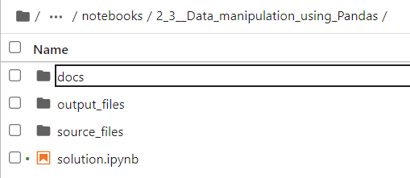
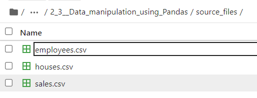
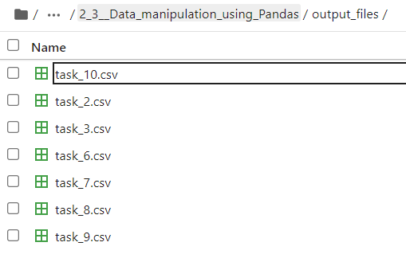

# Data manipulation using Pandas

## Purpose

These coding exercises are designed to test your knowledge of the following concepts:
* The Pandas framework

## Overview

The exercises cover the following practical problems:
* Data processing using Pandas

## Coding exercises

### Exercise 1: Process data using Pandas

Your task is to follow the instructions in the Jupyter notebook, do the data manipulations and save temporary results where it’s required.

NOTE: Your repository should contain Jupyter notebook with filled in cells and the required output files.

Please use `source_files` folder to get the source CSV files and `output_files` folder, which you will use to export results while completing your practical tasks:

After you are done with the practical task, your `output_files` folder should look like this:

Tasks that you need to solve inside the notebook:
1. Create three Dataframes (`sales`, `houses`, and `employees`) using the files in the `source_files` folder.
2. Extract first and last names from the `employees` DataFrame (use only rows 3 through 10 (included)) into a new DataFrame `names`. Save the `names` DataFrame as a CSV file ('output_files/task_2.csv').
3. Get the number of male and female employees (using the `.value_counts()` method). Save the resulting Series `amount_by_gender` as a CSV file ('output_files/task_3.csv').
4. Replace empty values in the `SQUARE` column of the `houses` DataFrame with zeros.
5. Create a new column `UNIT_PRICE` in the `houses` DataFrame using the following formula: `price / square`. Then, round the values in the column to two decimal places. If you cannot calculate the unit price (`square == 0`), set it to -1.
6. Sort the rows in the `houses` DataFrame so that price is descending. Save the sorted DataFrame (only the `HOUSE_ID`, `SQUARE`, `PRICE`, `UNIT_PRICE` columns) as a CSV file ('output_files/task_6.csv'). 
NOTE: Limiting the number of columns will reduce the size of the file by several times. The tests won't check the number of columns in the output, but please be aware that Git limits the size of a push, try not to exceed 100Mb.
7. Create a new DataFrame `employees_filtered` by filtering the `employees` using the following formula: `first name == "Vera"`. Save the result DataFrame as a CSV file ('output_files/task_7.csv').
8. Create a new DataFrame `grouped_houses` by filtering the `houses` DataFrame so that it keeps only houses with `square >= 100 m^2`, grouping rows by category and subcategory, and calculating the sizes of the resulting groups. Save the resulting DataFrame as a CSV file ('output_files/task_8.csv').
9. Update the column `SALEAMOUNT` (`sales` DataFrame) according to the following formula: `SALEAMOUNT = SALEAMOUNT + MEAN(SALEAMOUNT) * 0.02`. Save the updated DataFrame (only the `HOUSE_ID` and `SALEAMOUNT` columns) as a CSV file ('output_files/task_9.csv'). 
NOTE: Limiting the number of columns will reduce the size of the file by several times. The tests won't check the number of columns in the output, but please be aware that Git limits the size of a push, try not to exceed 100Mb.
10. Create a new DataFrame `houses_available` that contains all houses that have not been sold yet (they will exist in `houses`, but not in `sales`; you may use the `.join` method with the `house_id` column). Save the resulting DataFrame (only the `HOUSE_ID` column) as a CSV file ('output_files/task_10.csv').
